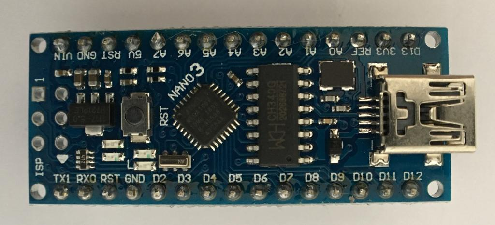
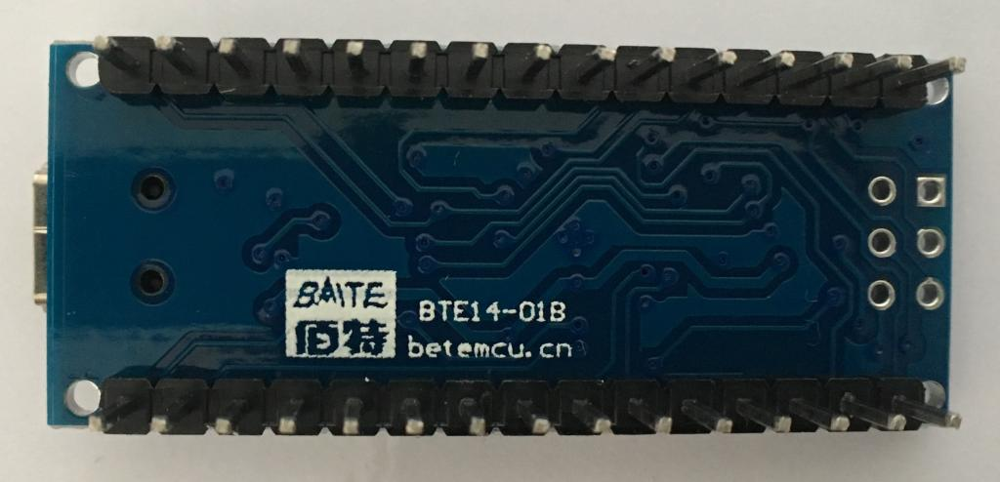
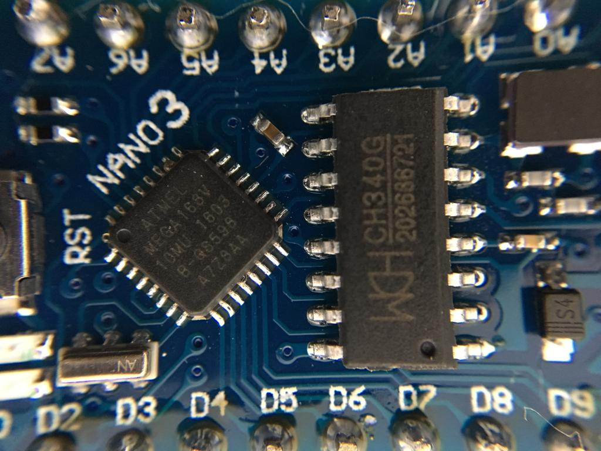

# BTE14-01B

Arduino clone.
Sold at:
* https://www.aliexpress.com/item/Nano-V3-0-3-0-ATmega168-CH340G-CH340-Mini-USB-UART-Interface-Board-Micro-controller-Module/32845416583.html
* https://www.aliexpress.com/item/Nano-V3-0-3-0-ATmega168-CH340G-CH340-Mini-USB-UART-Interface-Board-Micro-controller-Module/32674278303.html

Not really a Nano V3. You need CH340 drivers. Ubuntu already has them.

Settings for the Arduino IDE, different from Nano V3:
* Board: Arduino Nano (Arduino Duemilanove or Diecimila also works)
* Processor (important!): ATmega168
* Port: `/dev/ttyUSB0` (check `dmesg:` `[466300.873493] usb 1-3: ch341-uart converter now attached to ttyUSB0`)

I thought it didn't have a bootloader, but I was wrong. I didn't succeed to upload the bootloader anyway.

## Photos

